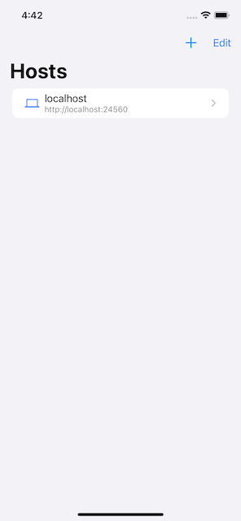
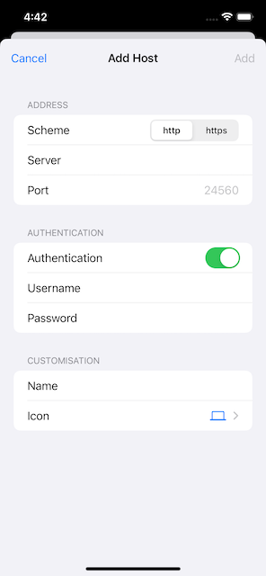
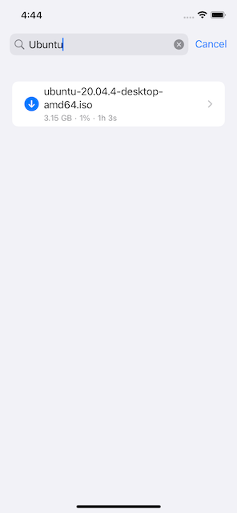
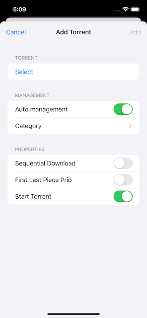
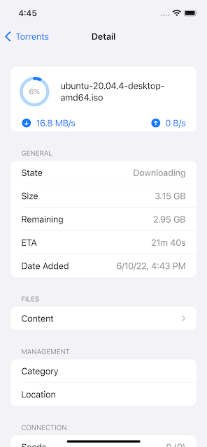
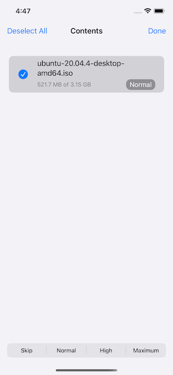

# yahms

An open-source qBittorrent client for iOS.

## Features

Handle torrents for multiple qBittorrent hosts.

- List and filter torrents.
- Order torrents by name, size and date added.
- See details of torrents including:
  - state
  - progress
  - size
  - eta
  - date added
  - speeds (download, upload, avg download, avg upload)
  - category
  - download location
- Navigate and change priority of torrent contents.
- Add new torrent via `.torrent` file.

### Screenshots

| Hosts | Adding host |
| --- | --- |
|  |  |

| Torrents | Add torrent | Torrent details | Torrent content |
| --- | --- | --- | --- |
|  |  | |  |

## Build locally

1. Clone repo.
1. Open `yahms.xcworkspace`.
1. Build and run.

## Dependencies

- [Alamofire](https://github.com/Alamofire/Alamofire)
- [KeychainSwift](https://github.com/evgenyneu/keychain-swift)
- [qBittorrentKit](https://github.com/adborbas/qBittorrentKit)
